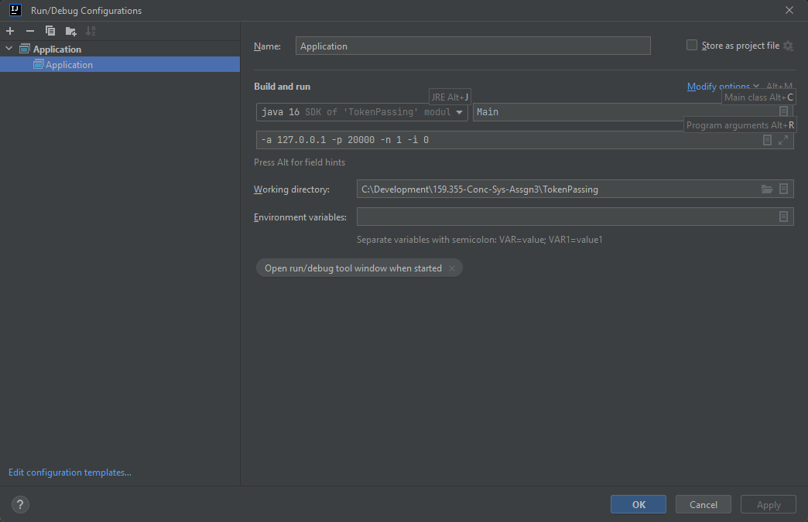
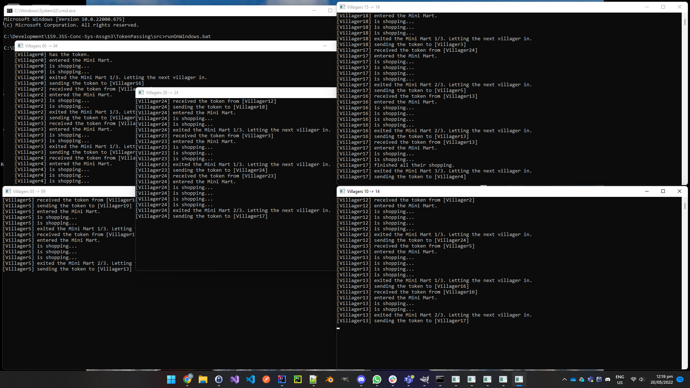
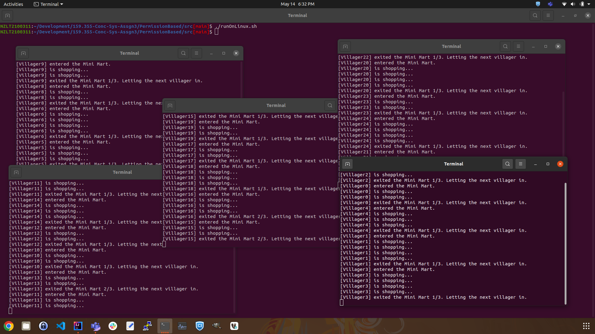

# Addressing Scheme

## Overview
To keep things simple for this assignment I chose to forego any sort of 'address book' containing villager addresses, or
any sort of 'address registrar' for villagers.

I have a trivial scheme based around one IP address and many ports. I chose to use UDP instead of TCP so that no
villager has to make TCP connections with other villagers. It would be a pain in the neck managing 24 connections for
each of the 25 villagers within the simulation.

## Implementation
The way it works is each villager is allocated an IP port number. The port numbers are allocated contiguously from a
starting port passed as a command line argument to the JVM. Therefore, we can write this knowledge into the Java source
code: if a villager wants to send a message to, say, villager 14 then they simply use 'startPort + 13'. To send to
villager 1 it's 'startPort + 0', villager 5 it's 'startPort + 4', and so on.

For this scheme to work all villagers must use the same IP address, which has the consequence that all villager nodes
must be run on the same machine. The IP address is passed as another command line argument to the JVM.

It would be inconvenient to run 25 instances of the JVM on a single machine. I chose instead to run 5 instances, each of
which I refer to as a 'node'. I chose to place 5 villagers within each node, therefore 5 nodes running 5 villagers each
meets the requirements for this assignment. Each node executes one instance of the JVM running my JAR file.

The final piece of information a node needs to participate in the simulation is which set of 5 ports will it use. It
could be startPort + 0 to 4, or startPort + 5 to 9, or startPort + 10 to 14, etc

## Example
An example of parameters to invoke just one node could look as follows:
> -a 127.0.0.1 -p 20000 -n 1 -i 0
>
> * **a** is the IP address
> * **p** is the port
> * **n** is the node count
> * **i** is the first index to use

I used exactly this command line for my IntelliJ Run/Debug configuration.



# Running all 25 Villagers

I've written a batch file and a shell script to run all 25 villagers. This gist of running all 25 is:

```
java -jar TokenPassing.jar -a 127.0.0.1 -p 20000 -n 5 -i 0
java -jar TokenPassing.jar -a 127.0.0.1 -p 20000 -n 5 -i 5
java -jar TokenPassing.jar -a 127.0.0.1 -p 20000 -n 5 -i 10
java -jar TokenPassing.jar -a 127.0.0.1 -p 20000 -n 5 -i 15
java -jar TokenPassing.jar -a 127.0.0.1 -p 20000 -n 5 -i 20
```

## Windows Batch File
Execute runOnWindows.bat from within a Windows command prompt. **YOU MUST BUILD THE JAR FILE FIRST**



## Linux Shell Script
Execute runOnLinux.sh from within a Bash Shell terminal. **YOU MUST BUILD THE JAR FILE FIRST**


